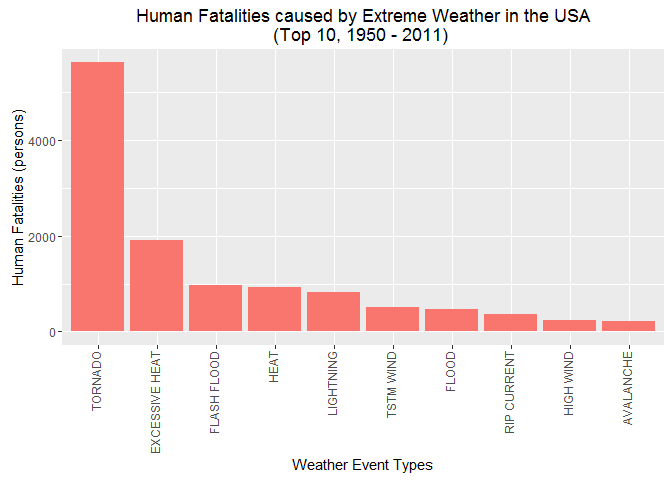
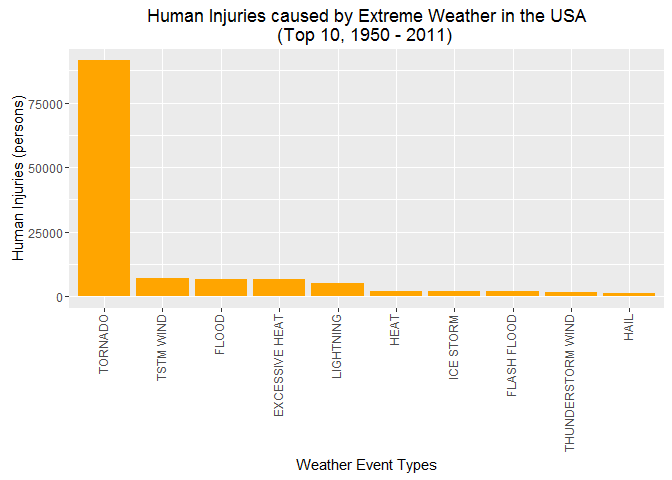
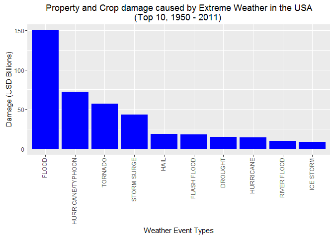

# Tornadoes, Flood and Hurricanes: Severe weather event types with the largest human and economic consequences (based on an initial analysis of the NOAA storm database).
ckkhan@gmail.com  
21 August 2016  


***

## Synopsis

Looking through more than 6 decades of recorded weather events in the USA, the three severe weather event types (Tornadoes, Flood and Hurricanes) has had the largest negative impact on human lives and the economy. This is the preliminary finding of analysis being performed on the U.S. National Oceanic and Atmospheric Administration's (NOAA) storm database.

This effort is by no means an easy task as the volume of data is large and its collection was not always performed in a standard manner. After loading, processing, standardizing, consolidating the data, the different types of severe weather event types were ranked in order of highest negative impact from the perspectives of human fatalities, injuries as well as property and agriculture damage/losses.

The following sections detail out the steps taken to prepare the STORM database data set as well as the results and initial findings.

***

## Data Processing

1. Retrieve a fresh copy of the data set, if missing
    
    ```r
        url<-"https://d396qusza40orc.cloudfront.net/repdata%2Fdata%2FStormData.csv.bz2"
        zfn<-"StormData.csv.bz2"
        if(!file.exists(zfn)) {
            download.file(url, zfn, mode="wb")
        }
    ```

2. Load data into R and keep only the subset of variables of interest (assumed to be needed to produce answers to the 2 specific questions).
    
    ```r
        stormdata<-read.csv(zfn)[c("EVTYPE", "FATALITIES", "INJURIES", "PROPDMG", "PROPDMGEXP", "CROPDMG", "CROPDMGEXP")]
    ```

3. Inspect the structure & summary of the resulting data.
    
    ```r
        str(stormdata)
    ```
    
    ```
    ## 'data.frame':	902297 obs. of  7 variables:
    ##  $ EVTYPE    : Factor w/ 985 levels "   HIGH SURF ADVISORY",..: 834 834 834 834 834 834 834 834 834 834 ...
    ##  $ FATALITIES: num  0 0 0 0 0 0 0 0 1 0 ...
    ##  $ INJURIES  : num  15 0 2 2 2 6 1 0 14 0 ...
    ##  $ PROPDMG   : num  25 2.5 25 2.5 2.5 2.5 2.5 2.5 25 25 ...
    ##  $ PROPDMGEXP: Factor w/ 19 levels "","-","?","+",..: 17 17 17 17 17 17 17 17 17 17 ...
    ##  $ CROPDMG   : num  0 0 0 0 0 0 0 0 0 0 ...
    ##  $ CROPDMGEXP: Factor w/ 9 levels "","?","0","2",..: 1 1 1 1 1 1 1 1 1 1 ...
    ```
    
    ```r
        summary(stormdata)
    ```
    
    ```
    ##                EVTYPE         FATALITIES          INJURIES        
    ##  HAIL             :288661   Min.   :  0.0000   Min.   :   0.0000  
    ##  TSTM WIND        :219940   1st Qu.:  0.0000   1st Qu.:   0.0000  
    ##  THUNDERSTORM WIND: 82563   Median :  0.0000   Median :   0.0000  
    ##  TORNADO          : 60652   Mean   :  0.0168   Mean   :   0.1557  
    ##  FLASH FLOOD      : 54277   3rd Qu.:  0.0000   3rd Qu.:   0.0000  
    ##  FLOOD            : 25326   Max.   :583.0000   Max.   :1700.0000  
    ##  (Other)          :170878                                         
    ##     PROPDMG          PROPDMGEXP        CROPDMG          CROPDMGEXP    
    ##  Min.   :   0.00          :465934   Min.   :  0.000          :618413  
    ##  1st Qu.:   0.00   K      :424665   1st Qu.:  0.000   K      :281832  
    ##  Median :   0.00   M      : 11330   Median :  0.000   M      :  1994  
    ##  Mean   :  12.06   0      :   216   Mean   :  1.527   k      :    21  
    ##  3rd Qu.:   0.50   B      :    40   3rd Qu.:  0.000   0      :    19  
    ##  Max.   :5000.00   5      :    28   Max.   :990.000   B      :     9  
    ##                    (Other):    84                     (Other):     9
    ```
The factors (EVTYPE, PROPDMGEXP and CROPDMGEXP) seem to have many more levels than expected or described in the NWS documentation. Quantities/measures seem small generally which suggests wide spread use of the exponential variables.

4. Remove data records having no Fatalities, Injuries, Property and Crop Damage as these are assumed to be irrelevant to the 2 specific questions to be addressed. This also reduces size of the data set to be handled significantly. Refactor the factors to remove unused levels.
    
    ```r
        stormdata<-stormdata[(stormdata$PROPDMG!=0 | stormdata$CROPDMG!=0 | stormdata$FATALITIES!=0 | stormdata$INJURIES!=0),]
        stormdata$EVTYPE<-factor(stormdata$EVTYPE, levels=unique(stormdata$EVTYPE))
        stormdata$PROPDMGEXP<-factor(stormdata$PROPDMGEXP, levels=unique(stormdata$PROPDMGEXP))
        stormdata$CROPDMGEXP<-factor(stormdata$CROPDMGEXP, levels=unique(stormdata$CROPDMGEXP))
        nrow(stormdata)
    ```
    
    ```
    ## [1] 254633
    ```
A lot less data to deal with.

5. Examine the unique exponentials.
    
    ```r
        unique(stormdata$PROPDMGEXP)
    ```
    
    ```
    ##  [1] K M   B m + 0 5 6 4 h 2 7 3 H -
    ## Levels: K M  B m + 0 5 6 4 h 2 7 3 H -
    ```
    
    ```r
        unique(stormdata$CROPDMGEXP)
    ```
    
    ```
    ## [1]   M K m B ? 0 k
    ## Levels:  M K m B ? 0 k
    ```
Multiply the Property and Crop Damage by its exponentials (of 10). Valid alphabetic abbreviations are H, K, M and B (case insensitive). Integer values (converted via as.integer) are assumed to mean the actual exponents of 10 (up to 12). Other values are assigned a multiplier of 1.
    
    ```r
        options(warn=-1)
        stormdata$PROPDMG<-stormdata$PROPDMG *
            ifelse(stormdata$PROPDMGEXP %in% c("h","H"), 10^2,
            ifelse(stormdata$PROPDMGEXP %in% c("k","K"), 10^3,
            ifelse(stormdata$PROPDMGEXP %in% c("m","M"), 10^6,
            ifelse(stormdata$PROPDMGEXP %in% c("b","B"), 10^9,
            ifelse(as.integer(as.character(stormdata$PROPDMGEXP)) %in% 1:12, 10^as.integer(as.character(stormdata$PROPDMGEXP)),
            1)))))
        stormdata$CROPDMG<-stormdata$CROPDMG *
            ifelse(stormdata$CROPDMGEXP %in% c("h","H"), 10^2,
            ifelse(stormdata$CROPDMGEXP %in% c("k","K"), 10^3,
            ifelse(stormdata$CROPDMGEXP %in% c("m","M"), 10^6,
            ifelse(stormdata$CROPDMGEXP %in% c("b","B"), 10^9,
            ifelse(as.integer(as.character(stormdata$CROPDMGEXP)) %in% 1:12, 10^as.integer(as.character(stormdata$CROPDMGEXP)),
            1)))))
        options(warn=0)
    ```

6. Summary of the Property and Crop Damage after application of multipliers.
    
    ```r
        summary(stormdata$PROPDMG)
    ```
    
    ```
    ##      Min.   1st Qu.    Median      Mean   3rd Qu.      Max. 
    ## 0.000e+00 2.000e+03 1.000e+04 1.682e+06 3.500e+04 1.150e+11
    ```
    
    ```r
        summary(stormdata$CROPDMG)
    ```
    
    ```
    ##      Min.   1st Qu.    Median      Mean   3rd Qu.      Max. 
    ## 0.000e+00 0.000e+00 0.000e+00 1.928e+05 0.000e+00 5.000e+09
    ```
7. Examine the unique ENTYPE values.
    
    ```r
        unique(stormdata$EVTYPE)
    ```
    
    ```
    ##   [1] TORNADO                        TSTM WIND                     
    ##   [3] HAIL                           ICE STORM/FLASH FLOOD         
    ##   [5] WINTER STORM                   HURRICANE OPAL/HIGH WINDS     
    ##   [7] THUNDERSTORM WINDS             HURRICANE ERIN                
    ##   [9] HURRICANE OPAL                 HEAVY RAIN                    
    ##  [11] LIGHTNING                      THUNDERSTORM WIND             
    ##  [13] DENSE FOG                      RIP CURRENT                   
    ##  [15] THUNDERSTORM WINS              FLASH FLOODING                
    ##  [17] FLASH FLOOD                    TORNADO F0                    
    ##  [19] THUNDERSTORM WINDS LIGHTNING   THUNDERSTORM WINDS/HAIL       
    ##  [21] HEAT                           HIGH WINDS                    
    ##  [23] WIND                           HEAVY RAINS                   
    ##  [25] LIGHTNING AND HEAVY RAIN       THUNDERSTORM WINDS HAIL       
    ##  [27] COLD                           HEAVY RAIN/LIGHTNING          
    ##  [29] FLASH FLOODING/THUNDERSTORM WI FLOODING                      
    ##  [31] WATERSPOUT                     EXTREME COLD                  
    ##  [33] LIGHTNING/HEAVY RAIN           BREAKUP FLOODING              
    ##  [35] HIGH WIND                      FREEZE                        
    ##  [37] RIVER FLOOD                    HIGH WINDS HEAVY RAINS        
    ##  [39] AVALANCHE                      MARINE MISHAP                 
    ##  [41] HIGH TIDES                     HIGH WIND/SEAS                
    ##  [43] HIGH WINDS/HEAVY RAIN          HIGH SEAS                     
    ##  [45] COASTAL FLOOD                  SEVERE TURBULENCE             
    ##  [47] RECORD RAINFALL                HEAVY SNOW                    
    ##  [49] HEAVY SNOW/WIND                DUST STORM                    
    ##  [51] FLOOD                          APACHE COUNTY                 
    ##  [53] SLEET                          DUST DEVIL                    
    ##  [55] ICE STORM                      EXCESSIVE HEAT                
    ##  [57] THUNDERSTORM WINDS/FUNNEL CLOU GUSTY WINDS                   
    ##  [59] FLOODING/HEAVY RAIN            HEAVY SURF COASTAL FLOODING   
    ##  [61] HIGH SURF                      WILD FIRES                    
    ##  [63] HIGH                           WINTER STORM HIGH WINDS       
    ##  [65] WINTER STORMS                  MUDSLIDES                     
    ##  [67] RAINSTORM                      SEVERE THUNDERSTORM           
    ##  [69] SEVERE THUNDERSTORMS           SEVERE THUNDERSTORM WINDS     
    ##  [71] THUNDERSTORMS WINDS            FLOOD/FLASH FLOOD             
    ##  [73] FLOOD/RAIN/WINDS               THUNDERSTORMS                 
    ##  [75] FLASH FLOOD WINDS              WINDS                         
    ##  [77] FUNNEL CLOUD                   HIGH WIND DAMAGE              
    ##  [79] STRONG WIND                    HEAVY SNOWPACK                
    ##  [81] FLASH FLOOD/                   HEAVY SURF                    
    ##  [83] DRY MIRCOBURST WINDS           DRY MICROBURST                
    ##  [85] URBAN FLOOD                    THUNDERSTORM WINDSS           
    ##  [87] MICROBURST WINDS               HEAT WAVE                     
    ##  [89] UNSEASONABLY WARM              COASTAL FLOODING              
    ##  [91] STRONG WINDS                   BLIZZARD                      
    ##  [93] WATERSPOUT/TORNADO             WATERSPOUT TORNADO            
    ##  [95] STORM SURGE                    URBAN/SMALL STREAM FLOOD      
    ##  [97] WATERSPOUT-                    TORNADOES, TSTM WIND, HAIL    
    ##  [99] TROPICAL STORM ALBERTO         TROPICAL STORM                
    ## [101] TROPICAL STORM GORDON          TROPICAL STORM JERRY          
    ## [103] LIGHTNING THUNDERSTORM WINDS   URBAN FLOODING                
    ## [105] MINOR FLOODING                 WATERSPOUT-TORNADO            
    ## [107] LIGHTNING INJURY               LIGHTNING AND THUNDERSTORM WIN
    ## [109] FLASH FLOODS                   THUNDERSTORM WINDS53          
    ## [111] WILDFIRE                       DAMAGING FREEZE               
    ## [113] THUNDERSTORM WINDS 13          HURRICANE                     
    ## [115] SNOW                           LIGNTNING                     
    ## [117] FROST                          FREEZING RAIN/SNOW            
    ## [119] HIGH WINDS/                    THUNDERSNOW                   
    ## [121] FLOODS                         COOL AND WET                  
    ## [123] HEAVY RAIN/SNOW                GLAZE ICE                     
    ## [125] MUD SLIDE                      HIGH  WINDS                   
    ## [127] RURAL FLOOD                    MUD SLIDES                    
    ## [129] EXTREME HEAT                   DROUGHT                       
    ## [131] COLD AND WET CONDITIONS        EXCESSIVE WETNESS             
    ## [133] SLEET/ICE STORM                GUSTNADO                      
    ## [135] FREEZING RAIN                  SNOW AND HEAVY SNOW           
    ## [137] GROUND BLIZZARD                EXTREME WIND CHILL            
    ## [139] MAJOR FLOOD                    SNOW/HEAVY SNOW               
    ## [141] FREEZING RAIN/SLEET            ICE JAM FLOODING              
    ## [143] COLD AIR TORNADO               WIND DAMAGE                   
    ## [145] FOG                            TSTM WIND 55                  
    ## [147] SMALL STREAM FLOOD             THUNDERTORM WINDS             
    ## [149] HAIL/WINDS                     SNOW AND ICE                  
    ## [151] WIND STORM                     GRASS FIRES                   
    ## [153] LAKE FLOOD                     HAIL/WIND                     
    ## [155] WIND/HAIL                      ICE                           
    ## [157] SNOW AND ICE STORM             THUNDERSTORM  WINDS           
    ## [159] WINTER WEATHER                 DROUGHT/EXCESSIVE HEAT        
    ## [161] THUNDERSTORMS WIND             TUNDERSTORM WIND              
    ## [163] URBAN AND SMALL STREAM FLOODIN THUNDERSTORM WIND/LIGHTNING   
    ## [165] HEAVY RAIN/SEVERE WEATHER      THUNDERSTORM                  
    ## [167] WATERSPOUT/ TORNADO            LIGHTNING.                    
    ## [169] HURRICANE-GENERATED SWELLS     RIVER AND STREAM FLOOD        
    ## [171] HIGH WINDS/COASTAL FLOOD       RAIN                          
    ## [173] RIVER FLOODING                 ICE FLOES                     
    ## [175] THUNDERSTORM WIND G50          LIGHTNING FIRE                
    ## [177] HEAVY LAKE SNOW                RECORD COLD                   
    ## [179] HEAVY SNOW/FREEZING RAIN       COLD WAVE                     
    ## [181] DUST DEVIL WATERSPOUT          TORNADO F3                    
    ## [183] TORNDAO                        FLOOD/RIVER FLOOD             
    ## [185] MUD SLIDES URBAN FLOODING      TORNADO F1                    
    ## [187] GLAZE/ICE STORM                GLAZE                         
    ## [189] HEAVY SNOW/WINTER STORM        MICROBURST                    
    ## [191] AVALANCE                       BLIZZARD/WINTER STORM         
    ## [193] DUST STORM/HIGH WINDS          ICE JAM                       
    ## [195] FOREST FIRES                   FROST\\FREEZE                 
    ## [197] THUNDERSTORM WINDS.            HVY RAIN                      
    ## [199] HAIL 150                       HAIL 075                      
    ## [201] HAIL 100                       THUNDERSTORM WIND G55         
    ## [203] HAIL 125                       THUNDERSTORM WIND G60         
    ## [205] THUNDERSTORM WINDS G60         HARD FREEZE                   
    ## [207] HAIL 200                       HEAVY SNOW AND HIGH WINDS     
    ## [209] HEAVY SNOW/HIGH WINDS & FLOOD  HEAVY RAIN AND FLOOD          
    ## [211] RIP CURRENTS/HEAVY SURF        URBAN AND SMALL               
    ## [213] WILDFIRES                      FOG AND COLD TEMPERATURES     
    ## [215] SNOW/COLD                      FLASH FLOOD FROM ICE JAMS     
    ## [217] TSTM WIND G58                  MUDSLIDE                      
    ## [219] HEAVY SNOW SQUALLS             SNOW SQUALL                   
    ## [221] SNOW/ICE STORM                 HEAVY SNOW/SQUALLS            
    ## [223] HEAVY SNOW-SQUALLS             ICY ROADS                     
    ## [225] HEAVY MIX                      SNOW FREEZING RAIN            
    ## [227] SNOW/SLEET                     SNOW/FREEZING RAIN            
    ## [229] SNOW SQUALLS                   SNOW/SLEET/FREEZING RAIN      
    ## [231] RECORD SNOW                    HAIL 0.75                     
    ## [233] RECORD HEAT                    THUNDERSTORM WIND 65MPH       
    ## [235] THUNDERSTORM WIND/ TREES       THUNDERSTORM WIND/AWNING      
    ## [237] THUNDERSTORM WIND 98 MPH       THUNDERSTORM WIND TREES       
    ## [239] TORNADO F2                     RIP CURRENTS                  
    ## [241] HURRICANE EMILY                COASTAL SURGE                 
    ## [243] HURRICANE GORDON               HURRICANE FELIX               
    ## [245] THUNDERSTORM WIND 60 MPH       THUNDERSTORM WINDS 63 MPH     
    ## [247] THUNDERSTORM WIND/ TREE        THUNDERSTORM DAMAGE TO        
    ## [249] THUNDERSTORM WIND 65 MPH       FLASH FLOOD - HEAVY RAIN      
    ## [251] THUNDERSTORM WIND.             FLASH FLOOD/ STREET           
    ## [253] BLOWING SNOW                   HEAVY SNOW/BLIZZARD           
    ## [255] THUNDERSTORM HAIL              THUNDERSTORM WINDSHAIL        
    ## [257] LIGHTNING  WAUSEON             THUDERSTORM WINDS             
    ## [259] ICE AND SNOW                   STORM FORCE WINDS             
    ## [261] HEAVY SNOW/ICE                 LIGHTING                      
    ## [263] HIGH WIND/HEAVY SNOW           THUNDERSTORM WINDS AND        
    ## [265] HEAVY PRECIPITATION            HIGH WIND/BLIZZARD            
    ## [267] TSTM WIND DAMAGE               FLOOD FLASH                   
    ## [269] RAIN/WIND                      SNOW/ICE                      
    ## [271] HAIL 75                        HEAT WAVE DROUGHT             
    ## [273] HEAVY SNOW/BLIZZARD/AVALANCHE  HEAT WAVES                    
    ## [275] UNSEASONABLY WARM AND DRY      UNSEASONABLY COLD             
    ## [277] RECORD/EXCESSIVE HEAT          THUNDERSTORM WIND G52         
    ## [279] HIGH WAVES                     FLASH FLOOD/FLOOD             
    ## [281] FLOOD/FLASH                    LOW TEMPERATURE               
    ## [283] HEAVY RAINS/FLOODING           THUNDERESTORM WINDS           
    ## [285] THUNDERSTORM WINDS/FLOODING    HYPOTHERMIA                   
    ## [287] THUNDEERSTORM WINDS            THUNERSTORM WINDS             
    ## [289] HIGH WINDS/COLD                COLD/WINDS                    
    ## [291] SNOW/ BITTER COLD              COLD WEATHER                  
    ## [293] RAPIDLY RISING WATER           WILD/FOREST FIRE              
    ## [295] ICE/STRONG WINDS               SNOW/HIGH WINDS               
    ## [297] HIGH WINDS/SNOW                SNOWMELT FLOODING             
    ## [299] HEAVY SNOW AND STRONG WINDS    SNOW ACCUMULATION             
    ## [301] SNOW/ ICE                      SNOW/BLOWING SNOW             
    ## [303] TORNADOES                      THUNDERSTORM WIND/HAIL        
    ## [305] FREEZING DRIZZLE               HAIL 175                      
    ## [307] FLASH FLOODING/FLOOD           HAIL 275                      
    ## [309] HAIL 450                       EXCESSIVE RAINFALL            
    ## [311] THUNDERSTORMW                  HAILSTORM                     
    ## [313] TSTM WINDS                     TSTMW                         
    ## [315] TSTM WIND 65)                  TROPICAL STORM DEAN           
    ## [317] THUNDERSTORM WINDS/ FLOOD      LANDSLIDE                     
    ## [319] HIGH WIND AND SEAS             THUNDERSTORMWINDS             
    ## [321] WILD/FOREST FIRES              HEAVY SEAS                    
    ## [323] HAIL DAMAGE                    FLOOD & HEAVY RAIN            
    ## [325] ?                              THUNDERSTROM WIND             
    ## [327] FLOOD/FLASHFLOOD               HIGH WATER                    
    ## [329] HIGH WIND 48                   LANDSLIDES                    
    ## [331] URBAN/SMALL STREAM             BRUSH FIRE                    
    ## [333] HEAVY SHOWER                   HEAVY SWELLS                  
    ## [335] URBAN SMALL                    URBAN FLOODS                  
    ## [337] FLASH FLOOD/LANDSLIDE          HEAVY RAIN/SMALL STREAM URBAN 
    ## [339] FLASH FLOOD LANDSLIDES         TSTM WIND/HAIL                
    ## [341] Other                          Ice jam flood (minor          
    ## [343] Tstm Wind                      URBAN/SML STREAM FLD          
    ## [345] ROUGH SURF                     Heavy Surf                    
    ## [347] Dust Devil                     Marine Accident               
    ## [349] Freeze                         Strong Wind                   
    ## [351] COASTAL STORM                  Erosion/Cstl Flood            
    ## [353] River Flooding                 Damaging Freeze               
    ## [355] Beach Erosion                  High Surf                     
    ## [357] Heavy Rain/High Surf           Unseasonable Cold             
    ## [359] Early Frost                    Wintry Mix                    
    ## [361] Extreme Cold                   Coastal Flooding              
    ## [363] Torrential Rainfall            Landslump                     
    ## [365] Hurricane Edouard              Coastal Storm                 
    ## [367] TIDAL FLOODING                 Tidal Flooding                
    ## [369] Strong Winds                   EXTREME WINDCHILL             
    ## [371] Glaze                          Extended Cold                 
    ## [373] Whirlwind                      Heavy snow shower             
    ## [375] Light snow                     Light Snow                    
    ## [377] MIXED PRECIP                   Freezing Spray                
    ## [379] DOWNBURST                      Mudslides                     
    ## [381] Microburst                     Mudslide                      
    ## [383] Cold                           Coastal Flood                 
    ## [385] Snow Squalls                   Wind Damage                   
    ## [387] Light Snowfall                 Freezing Drizzle              
    ## [389] Gusty wind/rain                GUSTY WIND/HVY RAIN           
    ## [391] Wind                           Cold Temperature              
    ## [393] Heat Wave                      Snow                          
    ## [395] COLD AND SNOW                  RAIN/SNOW                     
    ## [397] TSTM WIND (G45)                Gusty Winds                   
    ## [399] GUSTY WIND                     TSTM WIND 40                  
    ## [401] TSTM WIND 45                   TSTM WIND (41)                
    ## [403] TSTM WIND (G40)                Frost/Freeze                  
    ## [405] AGRICULTURAL FREEZE            OTHER                         
    ## [407] Hypothermia/Exposure           HYPOTHERMIA/EXPOSURE          
    ## [409] Lake Effect Snow               Freezing Rain                 
    ## [411] Mixed Precipitation            BLACK ICE                     
    ## [413] COASTALSTORM                   LIGHT SNOW                    
    ## [415] DAM BREAK                      Gusty winds                   
    ## [417] blowing snow                   GRADIENT WIND                 
    ## [419] TSTM WIND AND LIGHTNING        gradient wind                 
    ## [421] Gradient wind                  Freezing drizzle              
    ## [423] WET MICROBURST                 Heavy surf and wind           
    ## [425] TYPHOON                        HIGH SWELLS                   
    ## [427] SMALL HAIL                     UNSEASONAL RAIN               
    ## [429] COASTAL FLOODING/EROSION        TSTM WIND (G45)              
    ## [431] TSTM WIND  (G45)               HIGH WIND (G40)               
    ## [433] TSTM WIND (G35)                COASTAL EROSION               
    ## [435] SEICHE                         COASTAL  FLOODING/EROSION     
    ## [437] HYPERTHERMIA/EXPOSURE          WINTRY MIX                    
    ## [439] ROCK SLIDE                     GUSTY WIND/HAIL               
    ## [441]  TSTM WIND                     LANDSPOUT                     
    ## [443] EXCESSIVE SNOW                 LAKE EFFECT SNOW              
    ## [445] FLOOD/FLASH/FLOOD              MIXED PRECIPITATION           
    ## [447] WIND AND WAVE                  LIGHT FREEZING RAIN           
    ## [449] ICE ROADS                      ROUGH SEAS                    
    ## [451] TSTM WIND G45                  NON-SEVERE WIND DAMAGE        
    ## [453] WARM WEATHER                   THUNDERSTORM WIND (G40)       
    ## [455]  FLASH FLOOD                   LATE SEASON SNOW              
    ## [457] WINTER WEATHER MIX             ROGUE WAVE                    
    ## [459] FALLING SNOW/ICE               NON-TSTM WIND                 
    ## [461] NON TSTM WIND                  BLOWING DUST                  
    ## [463] VOLCANIC ASH                      HIGH SURF ADVISORY         
    ## [465] HAZARDOUS SURF                 WHIRLWIND                     
    ## [467] ICE ON ROAD                    DROWNING                      
    ## [469] EXTREME COLD/WIND CHILL        MARINE TSTM WIND              
    ## [471] HURRICANE/TYPHOON              WINTER WEATHER/MIX            
    ## [473] FROST/FREEZE                   ASTRONOMICAL HIGH TIDE        
    ## [475] HEAVY SURF/HIGH SURF           TROPICAL DEPRESSION           
    ## [477] LAKE-EFFECT SNOW               MARINE HIGH WIND              
    ## [479] TSUNAMI                        STORM SURGE/TIDE              
    ## [481] COLD/WIND CHILL                LAKESHORE FLOOD               
    ## [483] MARINE THUNDERSTORM WIND       MARINE STRONG WIND            
    ## [485] ASTRONOMICAL LOW TIDE          DENSE SMOKE                   
    ## [487] MARINE HAIL                    FREEZING FOG                  
    ## 488 Levels: TORNADO TSTM WIND HAIL ICE STORM/FLASH FLOOD ... FREEZING FOG
    ```
The remaining EVTYPE levels (488) are not easily mapped to the 48 types defined in the NWS documentation without resorting to guess work. For the sake of simplicity, this analysis will assume that each of the EVTYPES are unique and will focus on EVTYPES where its composition to the overall amount totals are small or insignificant.

8. Sum and sort (descending) the quantities of Human Fatalities and Injuries by EVTYPE, display the top 10.
    
    ```r
        humandmg<-aggregate(cbind(FATALITIES, INJURIES) ~ EVTYPE, stormdata, sum)
        humandmg$FATALITIESPCT<-humandmg$FATALITIES/sum(humandmg$FATALITIES)*100
        humandmg$INJURIESPCT<-humandmg$INJURIES/sum(humandmg$INJURIES)*100
        humandmg<-humandmg[order(-humandmg$FATALITIES),]
    
        head(humandmg,10)
    ```
    
    ```
    ##            EVTYPE FATALITIES INJURIES FATALITIESPCT INJURIESPCT
    ## 1         TORNADO       5633    91346     37.193793  65.0019925
    ## 56 EXCESSIVE HEAT       1903     6525     12.565203   4.6432028
    ## 17    FLASH FLOOD        978     1777      6.457577   1.2645167
    ## 21           HEAT        937     2100      6.186860   1.4943641
    ## 11      LIGHTNING        816     5230      5.387917   3.7216782
    ## 2       TSTM WIND        504     6957      3.327831   4.9506148
    ## 51          FLOOD        470     6789      3.103334   4.8310657
    ## 14    RIP CURRENT        368      232      2.429845   0.1650917
    ## 35      HIGH WIND        248     1137      1.637504   0.8090914
    ## 39      AVALANCHE        224      170      1.479036   0.1209723
    ```
    
    ```r
        sum(head(humandmg[order(-humandmg$FATALITIES),],10)$FATALITIESPCT)
    ```
    
    ```
    ## [1] 79.7689
    ```
    
    ```r
        head(humandmg[order(-humandmg$INJURIES),],10)
    ```
    
    ```
    ##               EVTYPE FATALITIES INJURIES FATALITIESPCT INJURIESPCT
    ## 1            TORNADO       5633    91346   37.19379333  65.0019925
    ## 2          TSTM WIND        504     6957    3.32783097   4.9506148
    ## 51             FLOOD        470     6789    3.10333443   4.8310657
    ## 56    EXCESSIVE HEAT       1903     6525   12.56520304   4.6432028
    ## 11         LIGHTNING        816     5230    5.38791680   3.7216782
    ## 21              HEAT        937     2100    6.18686035   1.4943641
    ## 55         ICE STORM         89     1975    0.58765269   1.4054139
    ## 17       FLASH FLOOD        978     1777    6.45757676   1.2645167
    ## 12 THUNDERSTORM WIND        133     1488    0.87817762   1.0588637
    ## 3               HAIL         15     1361    0.09904259   0.9684903
    ```
    
    ```r
        sum(head(humandmg[order(-humandmg$INJURIES),],10)$INJURIESPCT)
    ```
    
    ```
    ## [1] 89.3402
    ```
The top 10 constitutes roughly 80% (Fatalities) to 90% (Injuries) of its corresponding total.

9. Sum and sort (descending) the quantities of Property and Crop Damage by EVTYPE, display the top 10.
    
    ```r
        econdmg<-aggregate(cbind(PROPDMG, CROPDMG) ~ EVTYPE, stormdata, sum)
        econdmg$ECONDMGTOT<-econdmg$PROPDMG+econdmg$CROPDMG
        econdmg$PCT<-econdmg$ECONDMGTOT/sum(econdmg$ECONDMGTOT)*100
        econdmg<-econdmg[order(-econdmg$ECONDMGTOT),]
        head(econdmg,10)
    ```
    
    ```
    ##                EVTYPE      PROPDMG     CROPDMG   ECONDMGTOT       PCT
    ## 51              FLOOD 144657709807  5661968450 150319678257 31.491835
    ## 471 HURRICANE/TYPHOON  69305840000  2607872800  71913712800 15.065857
    ## 1             TORNADO  56947380677   414953270  57362333947 12.017356
    ## 95        STORM SURGE  43323536000        5000  43323541000  9.076242
    ## 3                HAIL  15735267513  3025954473  18761221986  3.930459
    ## 17        FLASH FLOOD  16822673979  1421317100  18243991079  3.822099
    ## 130           DROUGHT   1046106000 13972566000  15018672000  3.146398
    ## 114         HURRICANE  11868319010  2741910000  14610229010  3.060830
    ## 37        RIVER FLOOD   5118945500  5029459000  10148404500  2.126081
    ## 55          ICE STORM   3944927860  5022113500   8967041360  1.878587
    ```
    
    ```r
        sum(head(econdmg,10)$PCT)
    ```
    
    ```
    ## [1] 85.61574
    ```
The top 10 represents roughly 85% of the total amount.

***

## Results

###Types of events (across the United States) most harmful to population health

Tidy up the top 10 amount of human fatalities by Weather Event Type. Plot a bar graph showing the contributors in descending order.

```r
    dat1<-arrange(head(humandmg[order(-humandmg$FATALITIES),],10),-FATALITIES)
    dat1$EVTYPE<-factor(dat1$EVTYPE, levels=unique(dat1$EVTYPE))

    dat2<-arrange(head(humandmg[order(-humandmg$INJURIES),],10),-INJURIES)
    dat2$EVTYPE<-factor(dat2$EVTYPE, levels=unique(dat2$EVTYPE))

    p1<-ggplot(data=dat1) + geom_bar(aes(x=EVTYPE, y=FATALITIES, fill="red"), stat="identity") + theme(axis.text.x=element_text(angle=90, hjust=1, vjust=.25)) + theme(legend.position="none") + ggtitle("Human Fatalities caused by Extreme Weather in the USA\n(Top 10, 1950 - 2011) ") + ylab("Human Fatalities (persons)") + xlab("Weather Event Types")
    print(p1)
```

<!-- -->

```r
    dat1
```

```
##            EVTYPE FATALITIES INJURIES FATALITIESPCT INJURIESPCT
## 1         TORNADO       5633    91346     37.193793  65.0019925
## 2  EXCESSIVE HEAT       1903     6525     12.565203   4.6432028
## 3     FLASH FLOOD        978     1777      6.457577   1.2645167
## 4            HEAT        937     2100      6.186860   1.4943641
## 5       LIGHTNING        816     5230      5.387917   3.7216782
## 6       TSTM WIND        504     6957      3.327831   4.9506148
## 7           FLOOD        470     6789      3.103334   4.8310657
## 8     RIP CURRENT        368      232      2.429845   0.1650917
## 9       HIGH WIND        248     1137      1.637504   0.8090914
## 10      AVALANCHE        224      170      1.479036   0.1209723
```
**Looking at the plot and table above, Tornadoes seem to be the largest contributor towards human Fatalities (37% of total), then comes Heat related (18%), Flood (6%), Lightning (5%) and other Weather Events**

Tidy up the top 10 amount of human injuries by Weather Event Type. Plot a bar graph showing the contributors in descending order.

```r
    p2<-ggplot(data=dat2) + geom_bar(aes(x=EVTYPE, y=INJURIES), fill="orange", stat="identity") + theme(axis.text.x=element_text(angle=90, hjust=1, vjust=.25)) + theme(legend.position="none") + ggtitle("Human Injuries caused by Extreme Weather in the USA\n(Top 10, 1950 - 2011) ") + ylab("Human Injuries (persons)") + xlab("Weather Event Types")
    print(p2)
```

<!-- -->

```r
    dat2
```

```
##               EVTYPE FATALITIES INJURIES FATALITIESPCT INJURIESPCT
## 1            TORNADO       5633    91346   37.19379333  65.0019925
## 2          TSTM WIND        504     6957    3.32783097   4.9506148
## 3              FLOOD        470     6789    3.10333443   4.8310657
## 4     EXCESSIVE HEAT       1903     6525   12.56520304   4.6432028
## 5          LIGHTNING        816     5230    5.38791680   3.7216782
## 6               HEAT        937     2100    6.18686035   1.4943641
## 7          ICE STORM         89     1975    0.58765269   1.4054139
## 8        FLASH FLOOD        978     1777    6.45757676   1.2645167
## 9  THUNDERSTORM WIND        133     1488    0.87817762   1.0588637
## 10              HAIL         15     1361    0.09904259   0.9684903
```
**Looking at the plot and table above, Tornadoes appear to also be the largest contributor towards human Injuries (65% of total), followed by Thunderstorm Winds, Flood and Heat (each between 4%-5%), Lightning (3.7%) and other Weather Events**

###Types of events (across the United States) having the greatest economic consequences

Tidy up the top 10 amount of economic damage (Property + Crops) by Weather Event Type. Plot a bar graph showing the contributors in descending order.

```r
    dat3<-arrange(head(econdmg[order(-econdmg$ECONDMGTOT),],10),-ECONDMGTOT)
    dat3$EVTYPE<-factor(dat3$EVTYPE, levels=unique(dat3$EVTYPE))

    p3<-ggplot(data=dat3, aes(x=EVTYPE)) + geom_bar(aes(y=ECONDMGTOT/10^9), fill="blue", stat="identity") + theme(axis.text.x=element_text(angle=90, hjust=1, vjust=.25), legend.position="right") + ggtitle("Property and Crop damage caused by Extreme Weather in the USA\n(Top 10, 1950 - 2011) ") + ylab("Damage (USD Billions)") + xlab("Weather Event Types")
    print(p3)
```

<!-- -->

```r
    dat3
```

```
##               EVTYPE      PROPDMG     CROPDMG   ECONDMGTOT       PCT
## 1              FLOOD 144657709807  5661968450 150319678257 31.491835
## 2  HURRICANE/TYPHOON  69305840000  2607872800  71913712800 15.065857
## 3            TORNADO  56947380677   414953270  57362333947 12.017356
## 4        STORM SURGE  43323536000        5000  43323541000  9.076242
## 5               HAIL  15735267513  3025954473  18761221986  3.930459
## 6        FLASH FLOOD  16822673979  1421317100  18243991079  3.822099
## 7            DROUGHT   1046106000 13972566000  15018672000  3.146398
## 8          HURRICANE  11868319010  2741910000  14610229010  3.060830
## 9        RIVER FLOOD   5118945500  5029459000  10148404500  2.126081
## 10         ICE STORM   3944927860  5022113500   8967041360  1.878587
```
**Based on the plot and table above, Flood appears to be the main Weather Event, contributing to over USD 150 billion in damages over the 6 decade duration. It is followed by Hurricane/Typhoon (USD 71.9 billion), Tornadoes (USD 57.4 billion) and Storm Surge (USD 43.3 billion) and other Weather Events (each no more than 4% of the overall total)**

***

## Background & Data

Storms and other severe weather events can cause both public health and economic problems for communities and municipalities. Many severe events can result in fatalities, injuries, and property damage, and preventing such outcomes to the extent possible is a key concern.

This project involves exploring the U.S. National Oceanic and Atmospheric Administration's (NOAA) storm database. This database tracks characteristics of major storms and weather events in the United States, including when and where they occur, as well as estimates of any fatalities, injuries, and property damage.

The data for this assignment come in the form of a comma-separated-value file compressed via the bzip2 algorithm to reduce its size. You can download the file from this [link](https://d396qusza40orc.cloudfront.net/repdata%2Fdata%2FStormData.csv.bz2)

There is also some documentation of the database available. Here you will find how some of the variables are constructed/defined:

* National Weather Service [Storm Data Documentation](NWService_Storm_Data_Documentation.pdf)

* National Climatic Data Center Storm Events [FAQ](NCDC_Storm_Events_FAQ.pdf)

The events in the database start in the year 1950 and end in November 2011. In the earlier years of the database there are generally fewer events recorded, most likely due to a lack of good records. More recent years should be considered more complete.

***

## Assignment

The basic goal of this assignment is to explore the NOAA Storm Database and answer some basic questions about severe weather events. You must use the database to answer the questions below and show the code for your entire analysis. Your analysis can consist of tables, figures, or other summaries. You may use any R package you want to support your analysis.

<br/>

**Questions**

Your data analysis must address the following questions:

1. Across the United States, which types of events (as indicated in the **EVTYPE** variable) are most harmful with respect to population health?
2. Across the United States, which types of events have the greatest economic consequences?

Consider writing your report as if it were to be read by a government or municipal manager who might be responsible for preparing for severe weather events and will need to prioritize resources for different types of events. However, there is no need to make any specific recommendations in your report.

<br/>

**Document Layout**

* Language: Your document should be written in English.
* Title: Your document should have a title that **briefly** summarizes your data analysis
* Synopsis: Immediately after the title, there should be a **synopsis** which describes and summarizes your analysis in at **most 10 complete sentences**.
* There should be a section titled **Data Processing** which describes (in words and code) how the data were loaded into R and processed for analysis. In particular, your analysis must start from the raw CSV file containing the data. You cannot do any preprocessing outside the document. If preprocessing is time-consuming you may consider using the **cache = TRUE** option for certain code chunks.
* There should be a section titled **Results** in which your results are presented.
* You may have other sections in your analysis, but Data Processing and Results are **required**.
* The analysis document must have **at least one figure containing a plot**.
* Your analysis must have **no more than three figures**. Figures may have multiple plots in them (i.e. panel plots), but there cannot be more than three figures total.
* You must show all your code for the work in your analysis document. This may make the document a bit verbose, but that is okay. In general, you should ensure that **echo = TRUE** for every code chunk (this is the default setting in knitr).

<br/>

**Review Criteria**

1. Has either a (1) valid RPubs URL pointing to a data analysis document for this assignment been submitted; or (2) a complete PDF file presenting the data analysis been uploaded?
2. Is the document written in English?
3. Does the analysis include description and justification for any data transformations?
4. Does the document have a title that briefly summarizes the data analysis?
5. Does the document have a synopsis that describes and summarizes the data analysis in less than 10 sentences?
6. Is there a section titled "Data Processing" that describes how the data were loaded into R and processed for analysis?
7. Is there a section titled "Results" where the main results are presented?
8. Is there at least one figure in the document that contains a plot?
9. Are there at most 3 figures in this document?
10. Does the analysis start from the raw data file (i.e. the original .csv.bz2 file)?
11. Does the analysis address the question of which types of events are most harmful to population health?
12. Does the analysis address the question of which types of events have the greatest economic consequences?
13. Do all the results of the analysis (i.e. figures, tables, numerical summaries) appear to be reproducible?
14. Do the figure(s) have descriptive captions (i.e. there is a description near the figure of what is happening in the figure)?
15. As far as you can determine, does it appear that the work submitted for this project is the work of the student who submitted it?

